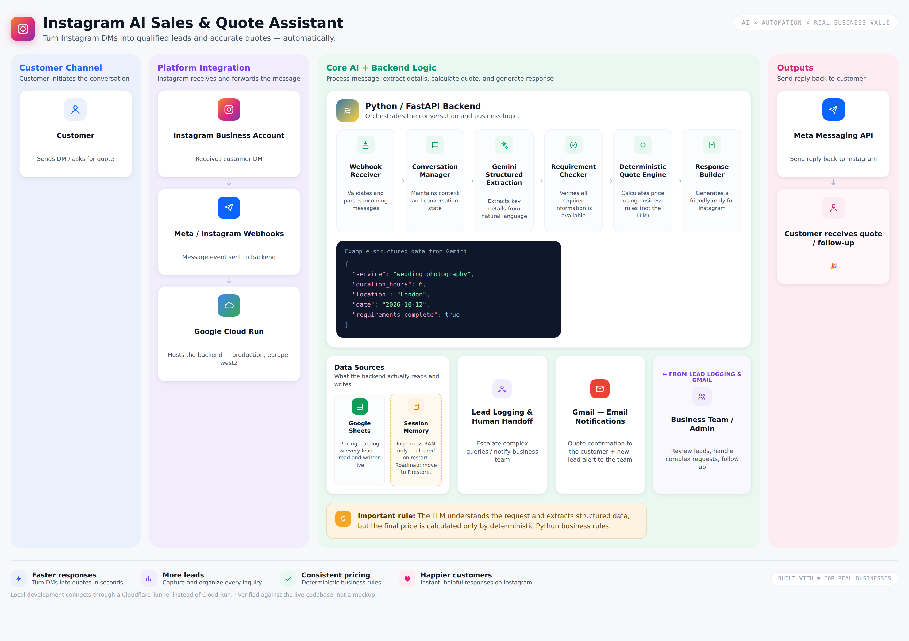

# Instagram AI Quote Assistant

A FastAPI service that handles Instagram DMs for a photography and videography
business: it collects quote details conversationally, prices them from Google
Sheets, saves leads, emails quotes, and hands off to a human on request.

Live on Cloud Run as `instagram-ai-quote-bot` (europe-west2).



---

## The rule the whole design rests on

**Gemini understands language. Python decides. Sheets holds the business data.**

Gemini only ever reports what a message *means* — an action, a field, a value.
It never prices anything, never writes to state, never invents a service or a
package. Python validates every interpretation against the approved catalogue
before it can change anything.

Most bugs in this project have come from that boundary being drawn in the wrong
place: Python's vocabulary being narrower than how customers actually talk, or
the adapter making a decision that belonged to Python. When something misbehaves,
look there first.

---

## Layout

For a file-by-file walkthrough of what each module does and how they
connect, see **[ARCHITECTURE.md](ARCHITECTURE.md)**.

For an interactive, click-through version of the architecture, open
**[how-it-works.html](https://krishnaannepu.github.io/instagram-ai-quote-bot/how-it-works.html)** in a browser.

For a visual map that shows exactly which files sit behind each part of
the system - click any block to see them - open **[code-map.html](https://krishnaannepu.github.io/instagram-ai-quote-bot/code-map.html)**.

Everything in the root is reachable from `main.py` or is part of the test gate.
Anything unreachable lives in `archive/`.

### Request path

```
Instagram  ->  main.py  ->  instagram_channel_adapter_v3
                              -> local_conversation_runtime_v3
                                   -> conversation_orchestrator
                                        -> gemini_semantic_adapter   (interpret)
                                        -> event_normalizer          (to an event)
                                        -> conversation_state_machine (decide)
                                        -> response_plan             (what to say)
                              -> customer_response_renderer_v3       (words)
                              -> instagram_sender_v3
```

### Key modules

| File | Responsibility |
|---|---|
| `main.py` | FastAPI app, webhook endpoints, legal pages |
| `semantic_contract.py` | What Gemini may return, and in which state. **The real conversation design lives here.** |
| `conversation_models.py` | `FlowState`, `ConversationContext`, `QuoteData` |
| `conversation_state_machine.py` | The only thing allowed to change state |
| `conversation_orchestrator.py` | Guards values against the catalogue, routes intent, builds the response plan |
| `gemini_semantic_adapter.py` | Prompt construction and response parsing. Never raises — degrades instead |
| `quote_service.py` | Deterministic pricing. No LLM involved |
| `sheets_service.py` | Google Sheets reads and lead writes |
| `turn_logger.py` | One structured record per customer turn |

### Conversation states

```
IDLE -> QUOTE_SERVICE -> QUOTE_PACKAGE -> QUOTE_COVERAGE -> QUOTE_TRAVEL
     -> QUOTE_DURATION -> QUOTE_DATE -> QUOTE_LOCATION -> QUOTE_READY
     -> EMAIL_CONFIRMATION -> EMAIL_ADDRESS -> POST_QUOTE -> FINISHED

interrupts: BUSINESS_INTERRUPT, PACKAGE_RECONFIRMATION, DEFERRED_REVIEW
human:      HANDOFF_OPTIONS, CALLBACK_PHONE, CALLBACK_PREFERENCE, CALLBACK_RECORDED
```

### Google Sheets

Workbook `AI Quote Assistant Database`:

- `Pricing` — service, package, included_hours, per-coverage prices, extra_hour_rate, travel_fee
- `Packages`, `Business_Info`, `FAQs` — what the bot may say
- `Leads`, `Conversation_State` — what it writes

Change pricing or add a package in the sheet. No redeploy needed; the bot reads
it live (300-second cache).

### archive/

Kept for reference, excluded from deploys by `.gcloudignore`.

- `legacy-v2-engine/` — the pre-V3 conversation engine
- `legacy-v2-tests/` — V2-era scripts
- `old-deploy/` — superseded architecture notes and Cloud Run config
- `scratch/` — debugging leftovers

---

## Before every deploy

```powershell
python run_regressions.py
```

Nine suites, all offline — no Gemini, no Sheets, no network. Green means safe
to deploy.

| Suite | Covers |
|---|---|
| `test_full_turn_matrix_v3.py` | **Every state x every action, end to end.** The one to trust |
| `test_contract_coverage_v3.py` | The adapter never raises; the prompt builds; the prompt asks for every key the parser reads |
| `test_finish_anywhere_v3.py` | "stop" ends the chat from anywhere, without Gemini |
| `test_change_request_v3.py` | Changing one or several details after a quote |
| `test_idle_entry_v3.py` | Typing instead of tapping |
| `test_service_correction_v3.py` | Corrections mid-quote; a failing turn still answers |
| `test_change_and_status_v3.py` | Status questions; invalid values |
| `test_production_screenshot_regression_v3.py` | The original production transcript |
| `test_production_defect_hotfix_v3.py` | Catalogue validation |

Tests assert **facts and state, never wording**. Asserting on exact sentences
produced repeated phantom failures. Keep it that way.

`v3_test_harness.py` runs canned Gemini JSON through the *real* adapter,
including prompt construction. Do not write a test double that skips a
production step — two live bugs got through exactly that way.

---

## Deploy

```powershell
python run_regressions.py
gcloud run deploy instagram-ai-quote-bot --source .
```

Check what is live:

```powershell
gcloud run services describe instagram-ai-quote-bot --region europe-west2 `
  --format="value(status.latestReadyRevisionName)"
```

---

## Debugging

Every customer turn writes a structured record. This answers "was it Gemini or
Python?" in seconds — do not theorise before reading it.

```powershell
gcloud logging read 'jsonPayload.message="v3_turn"' --limit 10 --format json
```

```jsonc
"interpretation": { "action": "FIELD_VALUE", "field_name": "package",
                    "value": "Wedding", "confidence": 0.99 },   // Gemini
"event":          { "type": "INVALID_FIELD_VALUE",
                    "source": "python_catalogue_guard" },        // Python
"before": { "state": "QUOTE_PACKAGE" },
"after":  { "state": "QUOTE_PACKAGE" }
```

`interpretation` is what Gemini decided. `event` is what Python decided. If
they disagree with what the customer saw, you know which side to fix.

Gaps between the two are logged separately:

```powershell
gcloud logging read 'jsonPayload.message="v3_contract_gap"' --limit 20
```

One occasionally is the safety net working. The same state/action pair
repeatedly means `STATE_ALLOWED_ACTIONS` is too narrow there.

---

## Configuration

`.env` (never committed):

```
INSTAGRAM_ACCESS_TOKEN=    INSTAGRAM_BUSINESS_ID=    META_API_VERSION=
GEMINI_API_KEY=            BUSINESS_OWNER_EMAIL=     BUSINESS_PHONE_NUMBER=
```

`credentials/` holds the Gmail OAuth token. Sheets authenticates through the
Cloud Run service account in production.

---

## Known open items

1. **Sessions live in process memory** (`session_repository_v3.py`). A restart,
   a new revision, or Cloud Run scaling past one instance drops in-flight
   conversations. Firestore is the intended fix and the largest remaining risk.
2. **The webhook is unauthenticated.** No `X-Hub-Signature-256` check, so anyone
   with the URL can post events. Verify the signature before real traffic.
3. **Prices are floats.** `Decimal` would be correct for money.
4. **Every file sits flat in the root.** No `src/`, `tests/` or
   `adapters/` folders yet. Kept flat to ship and test quickly;
   splitting it into packages is the next cleanup, not a rewrite.
